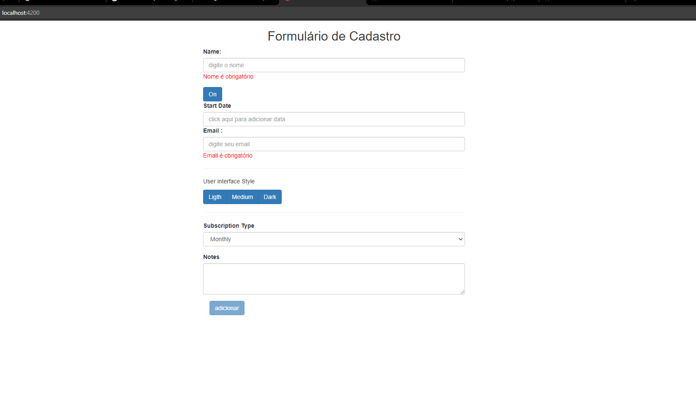

# WebForm

This project was generated with [Angular CLI](https://github.com/angular/angular-cli) version 6.1.1.

## Development server

Run `ng serve` for a dev server. Navigate to `http://localhost:4200/`. The app will automatically reload if you change any of the source files.

## Descrição do projeto 
- Formulario reativo criado no intuito de aprender como usar validações e mensagens amigavel ao usuario.

## Tecnologia
- Foi utilizado angular como framework 
- Para estilizar utilizamos o boostrap para ganhar velocidade no uso da tela.

# Imagem do site
